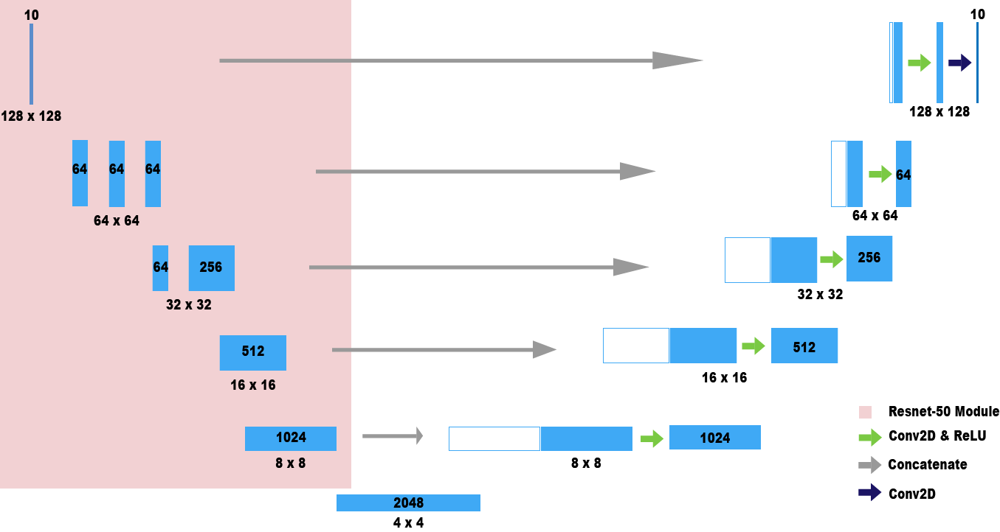

# Glacier Image Segmentation using ResNet-50

## Table of Contents

- [Introduction](#introduction)
- [Getting Started](#getting-started)
- [Prerequisites](#prerequisites)
- [Installation](#installation)
- [Usage](#usage)
- [Model Architecture](#model-architecture)
- [Dataset](#dataset)
- [Contributing](#contributing)
- [License](#license)

> **New to this project?** Start with **[docs/ONBOARDING.md](docs/ONBOARDING.md)** — a guide written
> for someone with no remote-sensing background. It covers the vocabulary, the pipeline end to end,
> the AWS layout, and what is currently broken.

## Introduction


This repository contains a machine learning model for performing image segmentation on glacier images using the pre-trained ResNet-50 model with a U-Net architecture and PyTorch framework. Image segmentation is the process of classifying each pixel in an image into a specific class, which is essential for tasks like understanding glacier boundaries and ice extent.

The model leverages the power of the ResNet-50 deep neural network architecture, which has demonstrated exceptional performance in various computer vision tasks, and applies it to the specific problem of glacier image segmentation.

## Getting Started

Follow the steps below to get started with using the glacier image segmentation model:

### Prerequisites

Before you begin, ensure you have the following prerequisites:

- Python 3.6+
- PyTorch (installation instructions in the [PyTorch documentation](https://pytorch.org/get-started/locally/))
- CUDA-enabled GPU (recommended for faster training and inference)

### Installation

1. Clone this repository to your local machine:

```bash
git clone https://github.com/mattwaismann/glacier-view-analysis.git
```

2. Navigate to the project directory:

```bash
cd glacier-view-analysis
```

3. Install the dependencies with [uv](https://docs.astral.sh/uv/):

```bash
uv sync
```

This creates a `.venv` from `pyproject.toml` and `uv.lock`, downloading the
right Python (3.12) if you don't have it. Prefix commands with `uv run`, e.g.
`uv run glacierview areas`, or activate `.venv` directly.

## Usage

Everything runs through one command; `--help` on any subcommand lists its flags.

```bash
uv run glacierview config                     # print every resolved path
uv run glacierview infer  --glims-id G007026E45991N --checkpoint <path>
uv run glacierview areas  --checkpoint <path>
uv run glacierview train  --epochs 10 --batch-size 32 --out-dir experiments/run1
```

Try training without downloading anything — a 32-pair fixture is committed:

```bash
uv run glacierview train --data-dir data/sample/training --epochs 2 \
  --batch-size 4 --out-dir /tmp/smoke --device cpu
```

### Layout

```
src/glacierview/        the package: import it, or drive it from the CLI
  config.py             paths and constants, overridable by env var
  rasters.py            read GeoTIFFs and DEMs
  preprocess.py         bands -> normalise -> resize -> indices
  bands.py              per-satellite band maps
  models/               the U-Net and checkpoint loading
  earthengine/          Earth Engine export
  inference/            predict, measure areas, render
  training/             dataset, losses, training loop
  cli.py                entry points
notebooks/
  pipeline/             numbered dataset-building steps
  exploration/          sandboxes
  analysis/             the published area analysis
sql/                    Athena queries
data/analysis/          committed reference CSVs
data/sample/training/   a 32-pair training fixture
docs/                   onboarding guide, design doc, model manifest
.agents/                agent-facing rules, context, skills, references
```

Paths come from `glacierview.config` and are environment-overridable, so the
~110 GB of imagery does not have to live in the checkout:

```bash
export GV_DATA_ROOT=/Volumes/T7/GlacierView
```

## Model Architecture

The glacier image segmentation model is based on the ResNet-50 architecture. The model takes an input image of 128x128 pixels with 7 bands, and produces a segmentation mask, where each pixel is classified as glacier or non-glacier. The ResNet-50 backbone is augmented with additional layers for semantic segmentation.

## Dataset

The dataset used for training and evaluation should include glacier images along with corresponding pixel-level masks indicating glacier boundaries. Organize your dataset in the following directory structure:

```
    training_data/
    ├── images/
    └── masks/
```

## Contributing

Contributions to this repository are encouraged! If you discover issues or have suggestions for improvements, please open an issue or submit a pull request. We welcome contributions from the community.

## License

This project is licensed under ...
---

**Disclaimer:** This model and repository are designed for educational and research purposes. The performance of the image segmentation model may vary depending on your dataset and specific use cases. It is recommended to thoroughly evaluate the model's results before making critical decisions based on its output.

For inquiries, contact ...
